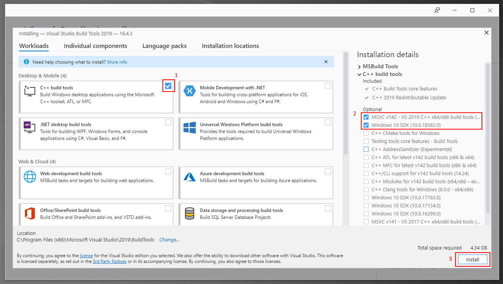
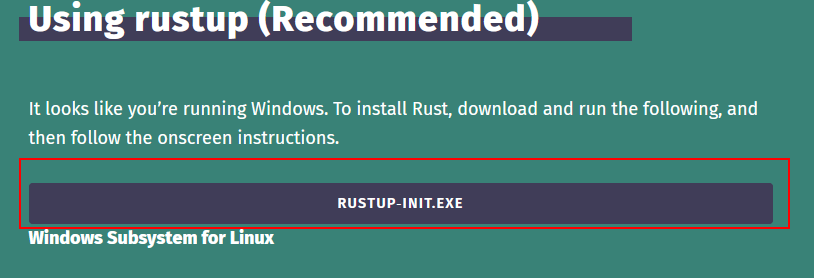
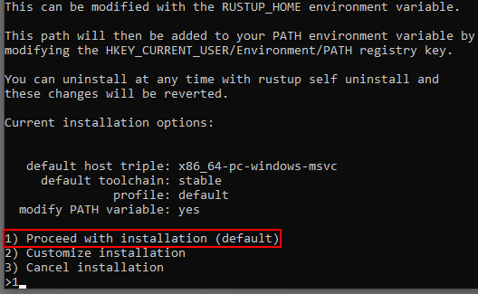

# rust-windows-10-guide
Installing Rust + Visual Studio Code and creating a hello world program

## Installing Rust
1. Go to https://visualstudio.microsoft.com/thank-you-downloading-visual-studio/?sku=BuildTools and download the BuildTools installer
2. Run the BuildTools installer
3. Select `C++ build tools` and include `MSVC C++ build tools` aswell as `Windows 10 SDK` then click install 
4. When BuildTools installation is complete, close the installer 
5. Go to https://www.rust-lang.org/tools/install and download the Rust installer 
6. Run the Rust installer and type 1 then enter to proceed with the default installation 
7. Press enter again to finish and close the installer

Rust should now be installed and operational

---
For the Visual Studio Code With Rust Support installation guide, [**CLICK HERE**](vscode.md)

For the Hello World sample code guide, [**CLICK HERE**](hello-world.md)