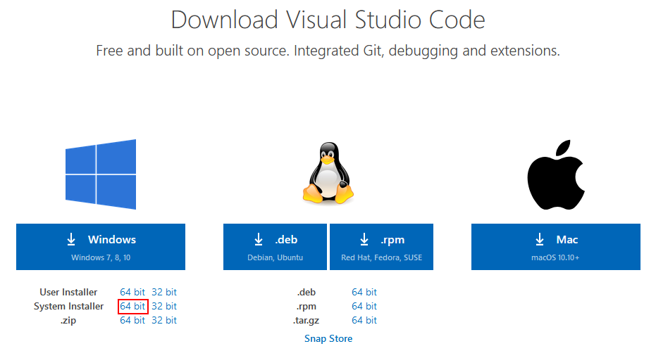
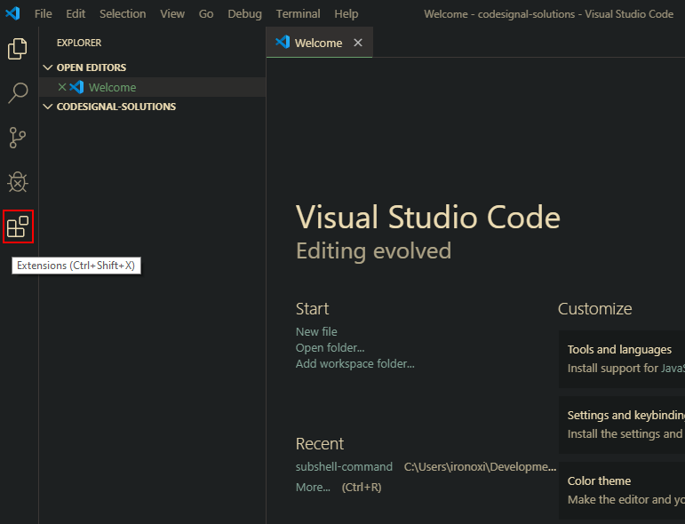
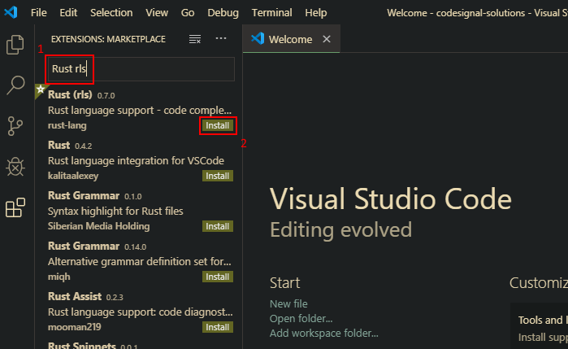

# rust-windows-10-guide
Installing Rust + Visual Studio Code and creating a hello world program

## Installing Visual Studio Code With Rust Support
1. Download Visual Studio Code from https://code.visualstudio.com/download 
2. Run the VSCode installer
3. Open VSCode and click the Extensions menu 
4. Search for `Rust rls` and click install 
5. Restart VSCode

Now Visual Studio Code will be installed with Rust support

---
For the Rust installation guide, [**CLICK HERE**](README.md)

For the Hello World sample code guide, [**CLICK HERE**](hello-world.md)